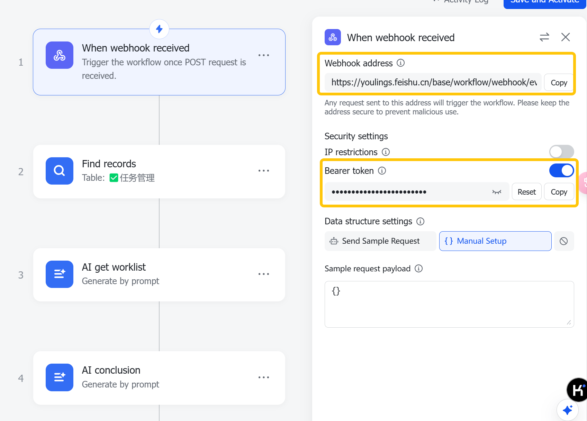

### 项目描述

`taskreport-feishutable` 是一个用于通过 Feishu Webhook 发送任务报告的工具。

### 安装步骤

1. 克隆仓库：
    ```sh
    git clone <repository-url>
    ```
2. 导航到项目目录：
    ```sh
    cd tool/taskreport-feishutable
    ```
3. 安装依赖：
    ```sh
    pip install requests
    ```

### 使用方法

1. 编辑 `app.py` 文件，设置 URL 和 Bearer Token。
2. 运行脚本：
    ```sh
    python app.py
    ```